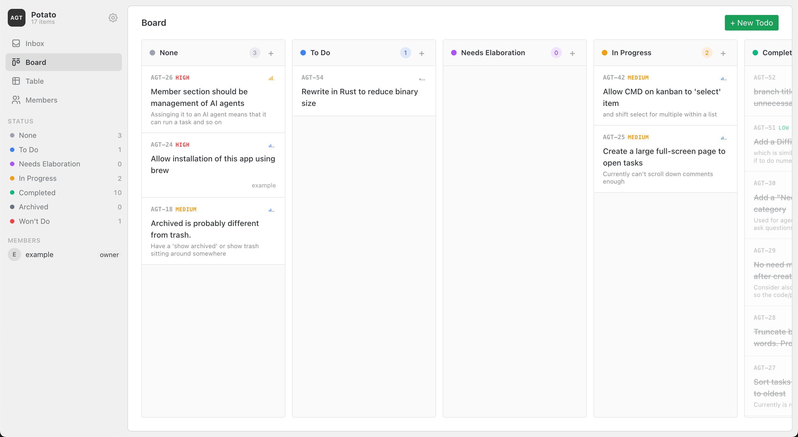

# agent-todo-list

- always felt tasks should be local
- inspired by:
    - https://github.com/hmans/beans
    - https://github.com/MrLesk/Backlog.md

# architecture

- cli, vue frontend
    - automerge, lefthook, oxfmt, oxlint
    - naive ui
    - makefile
    - bun (will rewrite in Rust or go, binary is too big)